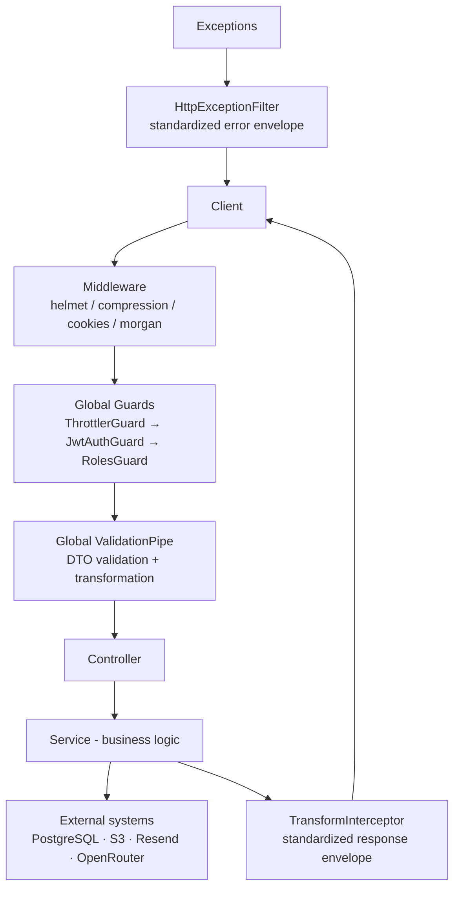

# Yaqin Backend

[](https://nestjs.com)
[](https://nodejs.org)
[](https://www.typescriptlang.org)
[](https://www.prisma.io)

> Yaqin is a structured, modular **NestJS educational backend** built around students, parents, teachers, members (content creators), and administrators.

The backend powers an Algerian-oriented educational platform: it manages users and student accounts, organizes curriculum content (grades → modules → units → lessons), runs quiz challenges with automatic grading and XP, exposes dashboards for parents and students, and provides AI-powered features (lesson question generation and student performance reports) .

It is designed as a serious production backend: strong authentication (JWT + Google OAuth + OTP), role-based authorization, PostgreSQL/Prisma persistence, object storage (S3) with signed URLs, transactional email (Resend), centralized exception handling, standardized API responses, rate limiting, validation, logging, and a modular architecture built for future expansion.

---

## Table of Contents

- [Technology Stack](#technology-stack)
- [Architecture Overview](#architecture-overview)
- [Project Structure](#project-structure)
- [Authentication](#authentication)
  - [JWT (Access + Refresh)](#jwt-access--refresh)
  - [Google OAuth](#google-oauth)
  - [OTP & Password Reset](#otp--password-reset)
- [Authorization](#authorization)
- [Global Backend Infrastructure](#global-backend-infrastructure)
- [API Response Format](#api-response-format)
- [Logging](#logging)
- [File Storage](#file-storage)
- [Real-Time](#real-time)
- [AI Architecture](#ai-architecture)
- [Modules & Endpoint Map](#modules--endpoint-map)
- [Domain Logic](#domain-logic)
- [Database](#database)
- [Running the Project](#running-the-project)
- [Environment Variables](#environment-variables)
- [Future Improvements](#future-improvements)

---

## Technology Stack

| Technology | Why it is used |
| --- | --- |
| **NestJS 11** | Structured, modular backend framework (controllers, services, guards, interceptors, filters, pipes). |
| **TypeScript 5.9** | Strict static typing across the whole codebase. |
| **PostgreSQL 16** | Primary relational database (provided via `docker-compose`). |
| **Prisma 7** | Type-safe ORM; schema-first models, migrations, and a generated client (`generated/prisma`). |
| **JWT (`@nestjs/jwt`)** | Stateless access-token authentication; signed refresh tokens. |
| **Google OAuth (passport-google-oauth20)** | "Sign in with Google" for parent accounts. |
| **OTP (bcrypt-hashed, email-delivered)** | Email verification / password-reset codes. |
| **Resend** | Transactional email provider (OTP delivery). |
| **AWS S3 SDK (`@aws-sdk/client-s3`)** | Object storage for profile images, lesson resources, and badges; signed URLs for read access. |
| **OpenRouter** | AI provider gateway for question generation and student report generation. |
| **Socket.IO (`@nestjs/platform-socket.io`)** | Real-time connection layer for students. |
| **Redis** | Provisioned in `docker-compose` and configured, but **not yet used by application code**. |
| **`class-validator` + `class-transformer`** | DTO validation and transformation. |
| **Winston + daily rotate + Morgan** | Structured application logging and HTTP request logging. |
| **`@nestjs/throttler`** | Global and per-route rate limiting. |
| **helmet / compression / cookie-parser** | Security headers, response compression, cookie parsing. |

---

## Architecture Overview

The API is a classic layered NestJS application. Every request flows through the same global pipeline:



External systems used by the application:

```text
PostgreSQL  → PrismaService (primary persistence)
S3          → profile images, lesson resources, badge images, signed URLs
Resend      → OTP / transactional email
Google OAuth→ authentication of parent accounts
OpenRouter  → AI question generation & student reports
Socket.IO  → real-time student connections (infrastructure present)
```

### Request Flow

1. **Middleware** hardens and prepares requests (security headers, compression, cookies, request logging).
2. **Global guards** enforce throttling, JWT authentication, and role authorization (unless the route is `@Public`).
3. The **global `ValidationPipe`** validates and transforms the DTO before it reaches the controller.
4. The **controller** delegates to a **service**, which implements business logic and talks to the database (usually through a thin **repo** layer) and external services.
5. Every response is wrapped by the **`TransformInterceptor`** into a consistent envelope.
6. Every thrown error is converted by the **`HttpExceptionFilter`** into a consistent error envelope.

---

## Project Structure

```text
src/
├── main.ts                     # Bootstrap: global middleware, pipes, WebSocket adapter
├── app.module.ts               # Root module wiring all feature modules
├── config/                     # Typed application configuration + env validation
├── common/                     # Shared, application-wide infrastructure
│   ├── constants/              # Metadata keys, pagination defaults, header names
│   ├── decorators/             # @Public, @Roles, @CurrentUser, @CurrentStudent, @ApiMessage
│   ├── dto/                    # Shared DTOs (pagination)
│   ├── filters/                # Global exception filter
│   ├── guards/                 # JWT, Roles, Student auth guards
│   ├── interceptors/           # Global response interceptor
│   ├── interfaces/             # Shared types (API response, request, auth, pagination)
│   ├── pipes/                  # ParseUuidPipe
│   └── utils/                  # Pagination helpers, safe-user mapper, validation errors
├── core/                       # Global infrastructure modules
│   ├── database/               # Prisma client + connection lifecycle
│   ├── jwt/                    # JWT signing / verification service
│   ├── logger/                 # Winston logger (console + daily rotating files)
│   ├── mail/                   # Resend email service
│   ├── sockets/                # Socket.IO adapter, gateway, presence tracking
│   └── storage/                # S3 upload / delete / signed URLs + validation
└── modules/                    # Feature modules
    ├── auth/                   # Registration, login, refresh, OAuth, password reset
    ├── otp/                    # OTP generation, hashing, email delivery, verification
    ├── storage/                # Public signed-URL API
    ├── roles/                  # Users, Teachers, Students
    ├── content/                # Units, Lessons, Skills, Questions, Resources, Comments
    ├── challenges/             # Quiz attempts + grading, Badges
    ├── dashboard/              # Parent dashboard, student stats & progress
    └── ai/                     # OpenRouter client, question generation, reports
```

The Prisma schema lives in `prisma/schema/` and migrations in `prisma/migrations/`. The generated Prisma client is output to `generated/prisma` (gitignored).

---

## Authentication

All routes live under the global prefix **`/api/v1`**.

### JWT (Access + Refresh)

The backend issues a **token pair** on every successful registration, login, and Google sign-in:

| Token | Where it is used | Lifetime (default) |
| --- | --- | --- |
| **Access token** | Returned in the response body; sent by clients as `Authorization: Bearer <token>` | `1d` (`JWT_ACCESS_EXPIRES_IN`) |
| **Refresh token** | Stored in an **`httpOnly`** cookie named `refresh_token` | `60d` (`JWT_REFRESH_EXPIRES_IN`) |

Both tokens are JWTs signed with different secrets (`JWT_ACCESS_SECRET` / `JWT_REFRESH_SECRET`) and carry a `type` claim (`access` / `refresh`) plus `sub`, `email`, and `role`. Verification rejects tokens whose `type` does not match the expected usage.

- **Enforcement:** the global `JwtAuthGuard` runs on every route except those marked `@Public`. It extracts the Bearer token, verifies it, and attaches `request.user = { id, email, role }`.
- **Refresh flow:** `POST /auth/refresh` reads the `refresh_token` cookie, verifies it, loads the user, and returns a fresh access token.
- **Logout:** `POST /auth/logout` (authenticated) clears the refresh-token cookie.
- **Cookie behavior:** the refresh cookie is `httpOnly`, optional `secure` / `sameSite` / `domain` (from `COOKIE_SECURE`, `COOKIE_SAME_SITE`, `COOKIE_DOMAIN`), with a `maxAge` matching the refresh-token lifetime.

### Google OAuth

```text
Client
  ↓  redirect
GET /api/v1/auth/google        (passport GoogleStrategy)
  ↓
Google OAuth consent
  ↓  redirect with profile
GET /api/v1/auth/google/callback
  ↓
Backend finds user by email
  ↓
  • existing user without googleId → attach googleId
  • existing user with googleId    → authenticate
  • no user                        → create new PARENT account
  ↓
Sign access + refresh tokens, set refresh cookie
  ↓
Application
```

- The strategy requests the `email` and `profile` scopes.
- If Google returns no email, the strategy fails the flow with an error.
- Successful callbacks return `{ user, accessToken }` and set the refresh cookie.

### OTP & Password Reset

The OTP system is used for the **forgot-password** flow (an `EMAIL_VERIFICATION` OTP type also exists in the schema/enum but is not currently exposed by an endpoint).

- **Generation:** `POST /auth/forgot-password` with an email triggers a 6-digit code, hashed with **bcrypt (cost 10)** and stored in the `Otp` table with a **15-minute expiry** (single-use). The plain code is emailed through **Resend**.
- **Verification:** `POST /auth/reset-password` accepts `email`, `code`, and `newPassword`. The backend looks up the latest **unused, non-expired** OTP for that user/type, bcrypt-compares the submitted code, marks it used, and updates the password (bcrypt-hashed).
- **Invalid/expired codes** return `400 Bad Request` with `"Invalid or expired code."`
- **Rate limiting:** `forgot-password` is limited to 3 requests/min and `reset-password` / `login` to 5 requests/min.

---

## Authorization

Authorization is role-based, layered on top of JWT authentication.

### Roles

```text
ADMIN   → full administrative control (users, content, badges, AI, reports)
PARENT  → creates and manages students, parent dashboard, AI reports
TEACHER → manages their own profile and assigned modules
MEMBER  → educational content authoring (lessons, units, skills, questions, resources, AI questions)
```

**Students are not a `UserRole`.** They authenticate through a **student code** instead (see [Student access](#student-access)).

### How access is enforced

| Layer | Mechanism |
| --- | --- |
| **JWT authentication** | Global `JwtAuthGuard` (skipped on `@Public` routes). |
| **Role authorization** | Global `RolesGuard` reads `@Roles(...)` metadata from the handler/class. |
| **Rate limiting** | Global `ThrottlerGuard` (100 req/min default; stricter on auth routes). |
| **Student authentication** | `StudentAuthGuard` on selected routes; requires the `x-student-code` header and loads the student from the database. |
| **Ownership checks** | Service-level checks, e.g. users may only update their own profile, parents only delete their own students. |

### Decorators

```text
@Public
Marks an endpoint as publicly accessible and bypasses the global JWT guard.

@Roles(...)
Restricts an endpoint to specific application roles (ADMIN, PARENT, TEACHER, MEMBER).

@CurrentUser
Injects the authenticated user ({ id, email, role } or a single property) into the handler.

@CurrentStudent
Injects the authenticated student ({ code, fullName, gradeCode } or a single property) into the handler.

@ApiMessage(...)
Customizes the `message` field of the success response envelope.
```

### Student access

Students authenticate with a **student code** (`x-student-code` header) rather than a JWT:

- `POST /students/login` validates a code (and optionally records the device name).
- `StudentAuthGuard` (used by student-scoped routes such as `/students/me`, comments, attempts, and dashboards) resolves the header to a real student record.
- Codes are human-readable identifiers generated as `NAME-RANDOM-DATE` (see [Students](#students)).

---

## Global Backend Infrastructure

Everything in `src/common` is registered globally in `CommonModule`:

### Global Guards

```text
ThrottlerGuard  → enforces the global request rate limit (100 req/min) and per-route overrides.
JwtAuthGuard    → authenticates every route unless marked @Public.
RolesGuard      → enforces @Roles(...) metadata; 403 when the role does not match.
StudentAuthGuard→ resolves the x-student-code header into a StudentSelf object.
```

### Global Response Interceptor

`TransformInterceptor` wraps every successful controller result:

- Plain data → `{ success: true, data, message? }`
- Paginated results (objects containing `data` + `meta`) → `{ success: true, data: [...], meta, message? }`

### Global Exception Filter

`HttpExceptionFilter` catches **all** exceptions:

- `HttpException` → its status code and message (arrays are joined).
- Anything else → `500 Internal Server Error` ("Internal server error") and the exception is logged.
- Errors carrying a `details` payload are passed through (used by validation errors).

### Validation

A global `ValidationPipe` is configured with:

```text
whitelist: true              → strips unknown body properties
forbidNonWhitelisted: true   → rejects bodies containing unknown properties
transform: true              → auto-converts query/param/body into DTO instances
exceptionFactory: (...)      → produces a custom ValidationException (400)
```

Validation failures return `400 Bad Request` with a flattened `details` map (`field → error messages`), including nested fields.

### Pipes

```text
ParseUuidPipe → validates UUID route parameters and returns 400 for malformed UUIDs.
```

### Pagination

List endpoints accept `page`, `limit` (max 100), `sortBy`, and `order` (asc/desc), with sensible whitelisted sort fields per resource. Paginated responses include a `meta` object:

```json
{ "page": 1, "limit": 20, "total": 157, "totalPages": 8 }
```

---

## API Response Format

### Success

```json
{
  "success": true,
  "message": "Lesson created successfully.",
  "data": { }
}
```

### Paginated success

```json
{
  "success": true,
  "data": [ ],
  "meta": { "page": 1, "limit": 20, "total": 0, "totalPages": 0 }
}
```

### Error

```json
{
  "success": false,
  "statusCode": 404,
  "message": "Lesson not found."
}
```

### Validation error (400)

```json
{
  "success": false,
  "statusCode": 400,
  "message": "Validation error",
  "details": {
    "email": "must be a valid email",
    "password": "must be at least 8 characters"
  }
}
```

HTTP status codes follow the actual operation: `200`/`201` on success, `400` for validation/bad input, `401` for missing/invalid credentials, `403` for role/ownership violations, `404` for missing resources, `409` for conflicts (e.g. duplicate email), `500` for unhandled errors.

---

## Logging

Logging is handled by a global **Winston** logger (`LoggerService`) plus **Morgan** for HTTP access logs.

- **Application logs** use `LoggerService` with `service` metadata:
  - Development: colorized console output **and** daily rotating files.
  - Production: JSON lines written to daily rotating files only.
  - Files: `logs/app-YYYY-MM-DD.log`, kept for **14 days**, zipped when rotated.
- **HTTP request logs** are produced by `morgan` (`combined` format in production, `dev` in development).
- **Error logging:** the global exception filter logs every unhandled exception with its stack trace; services (mail, storage, AI) log failures with stack traces.
- Security: credentials and secrets are never logged (only entity IDs and sanitized messages).

---

## File Storage

Storage is centralized in `src/core/storage` and exposed through a public signed-URL endpoint.

- **Provider:** AWS S3 (via `@aws-sdk/client-s3`), with optional custom `S3_ENDPOINT` for S3-compatible providers.
- **Abstraction:** `StorageService` exposes `upload`, `delete`, and `getSignedUrl`; controllers never touch the S3 client directly.
- **Validation:** `StorageFilter` rejects empty files, files over the size limit (default **12 MB**), and disallowed MIME types. Allowed groups: `images` (jpeg/png/webp/gif), `documents` (pdf/doc/docx), and `video` (mp4/webm). Specific uploads tighten limits (e.g. profile images: images only, 5 MB).
- **Storage prefixes:** keys are generated as `<prefix>/<uuid>.<ext>` — `pfp/` (user avatars), `students/` (student photos), `lessons/` (lesson resources), `badges/` (badge images).
- **Read access:** files are **not** streamed through the API. `POST /storage/signed-url` returns a short-lived presigned URL (`S3_SIGNED_URL_EXPIRES_IN`, default 3600s), optionally with a download filename.
- **Why object storage:** large binaries (images, videos, documents) stay out of PostgreSQL, keeping the database small and queries fast, while S3 provides scalable storage, CDN-friendly URLs, and expiring access control.

---

## Real-Time

A Socket.IO layer is wired up via a custom `SocketIoAdapter` (CORS-aware) and a global `SocketGateway`:

- Students connect with `{ studentCode }` in the **handshake auth** payload. Connections without a valid code are rejected.
- Each student is placed in a personal room (`student:<code>`), and presence is tracked in memory (`SocketPresenceService` — connect/disconnect counts, `isOnline`, active counts).
- The gateway exposes `emitToStudent`, `emitToRoom`, and `broadcast` helpers.


## AI Architecture

AI features are kept **behind the backend** — provider credentials (`OPENROUTER_API_KEY`) never reach clients. All AI calls go through a single `OpenRouterService` that talks to the OpenRouter chat-completions API and requests JSON output.

```text
Client
  ↓
NestJS AI endpoint  (POST /api/v1/ai/question · POST /api/v1/ai/report/:studentCode)
  ↓
AI service          (QuestionService / ReportService)
  ↓
Context preparation (lesson + skills + grade, or student activity + stats)
  ↓
Prompt template     (Arabic, Algerian curriculum, strict JSON schema)
  ↓
OpenRouter          (model configured via OPENROUTER_MODEL)
  ↓
Structured result   (parsed JSON, validated at runtime)
  ↓
API response
```

### Question generation

`POST /api/v1/ai/question` (`MEMBER`, `ADMIN`)

Loads the full lesson context — content, difficulty, unit, module, grade, and linked skills — and asks the model to produce `count` (1–20) questions of the types `SINGLE_CHOICE`, `TRUE_FALSE`, or `SHORT_ANSWER`, following strict rules (4 options for single choice, no "all of the above", Arabic, no Markdown, valid JSON). Returns the parsed `{ questions: [...] }` payload for review; questions are **not** auto-inserted into the database.

### Student reports

`POST /api/v1/ai/report/:studentCode` (`ADMIN`, `PARENT`)

Builds a context from the student's recent progress — attempted/completed lessons, accuracy, per-skill statistics, and the previous report — and asks the model for an Arabic report (`summary`, `strengths`, `weaknesses`, `progress`, `recommendations`). Reports are cached:

- A fresh report is only generated if the latest one is **older than one week**; otherwise the cached report is returned (`cached: true`).
- Activity is incremental — only progress created after the previous report's `coveredUntil` is included.

`GET /api/v1/ai/report/:studentCode` (public) lists a student's report history.

---

## Modules & Endpoint Map

Base route | Module
--- | ---
`/api/v1/auth` | Auth
`/api/v1/users` | User management
`/api/v1/teachers` | Teachers
`/api/v1/students` | Students
`/api/v1/storage` | Storage (signed URLs)
`/api/v1/lessons` · `/api/v1/units` · `/api/v1/skills` | Content
`/api/v1/attempts` · `/api/v1/badges` | Challenges
`/api/v1/dashboard` | Dashboards
`/api/v1/ai` | AI features

### Auth — `/api/v1/auth`

- `POST /register/parent` · `POST /register/teacher` · `POST /register/member`
- `POST /login` · `POST /refresh` · `POST /logout` · `GET /me`
- `POST /forgot-password` · `POST /reset-password`
- `GET /google` · `GET /google/callback`

### Roles

```text
Users      → GET /users (admin) · GET/PATCH/DELETE /users/:id ·
              POST/DELETE /users/:id/image · PATCH /users/:id/verify (admin)
Teachers   → GET /teachers (public) · GET /teachers/:id (public) · GET /teachers/me ·
              PATCH /teachers/me · GET /teachers/admin ·
              POST /teachers/:id/modules · DELETE /teachers/:id/modules/:moduleId
Students   → GET /students (admin) · GET /students/rankings (public) ·
              POST /students/login (public) · POST /students/signup (public) ·
              POST /students (parent) · DELETE /students/:code (parent) ·
              GET/PATCH /students/me · POST/DELETE /students/me/image  (x-student-code)
```

### Content

```text
Units       → GET /units · GET /units/:id (public) · POST · PATCH /:id · DELETE /:id  (member/admin)
Lessons     → GET /lessons · GET /lessons/:id (public, published only) ·
              GET /lessons/manage (member/admin) · POST · PATCH /:id · DELETE /:id
Skills      → GET /skills · GET /skills/:id (public, published only) ·
              GET /skills/manage · GET /skills/manage/:id · POST · PATCH /:id ·
              DELETE /:id · POST /:id/lessons  (member/admin)
Questions   → GET /lessons/:lessonId/questions · GET .../:id (public) ·
              POST (member/admin) · DELETE /lessons/:lessonId/questions/:id
Resources   → GET /lessons/:lessonId/resources (jwt) ·
              POST (member/admin, ≤10 files) · DELETE /lessons/:lessonId/resources/:id
Comments    → GET · POST · DELETE /lessons/:lessonId/comments/:id   (x-student-code)
```

### Challenges

```text
Attempts    → POST /attempts (start) · POST /attempts/:attemptId/submit ·
              GET /attempts?studentCode=… · GET /attempts/:attemptId   (start/submit: x-student-code)
Badges      → GET /badges · GET /badges/:id (public) ·
              POST · PATCH /:id · DELETE /:id · POST /:id/students   (admin)
```

### Dashboards

```text
Parent     → GET /dashboard/parents                          (parent)
Students   → GET /dashboard/students/stats · .../stats/profile (x-student-code)
             GET /dashboard/students/progress · .../progress/modules/:moduleCode ·
             .../progress/lessons/:lessonId                   (x-student-code)
```

### AI

```text
AI    → POST /ai/question                     (member/admin)
        GET  /ai/report/:studentCode          (public)
        POST /ai/report/:studentCode          (admin/parent)
```

### Storage

```text
Storage → POST /storage/signed-url   (public) → { key, url }
```

> **Note:** an **Admin module** (`/admin/login`, `/admin/stats`) exists in `src/modules/admin` but is **not currently imported** in `src/app.module.ts`, so its routes are not registered by the running application.

---

## Domain Logic

### Students

- **Identity:** a student is identified by a human-readable **code** (primary key), generated as `NAME-RANDOM-DATE` (e.g. `FATEH-8K2MQP-05042012`) — first letters of the name, a random alphanumeric chunk, and a birthdate (or random date).
- **Attributes:** `gradeCode`, `semester`, `fullName`, `dateOfBirth`, `schoolName`, `wilaya`, cumulative `xp`, optional `imagePath`, and `deviceName` (recorded at login).
- **Parent relationship:** a student optionally belongs to one `Parent`; parents create/delete students and see their dashboards.
- **Progress & context for AI:** per-lesson progress (`StudentProgress`), quiz attempts/answers, XP transactions, skills, badges, and reports all feed student dashboards and AI reports.

### Lessons / Content

- Content is organized as **Grade → Module → Unit → Lesson**, each lesson carrying title, HTML/text `content`, difficulty, XP reward, order, and `minPresent` (pass threshold).
- Lessons **belong to a Member author** (`memberId`). Authors create lessons in `DRAFT` status; the public can only see `PUBLISHED` lessons.
- Members manage their **own** lessons (scoped by author) while admins see everything.
- Lessons can link to **skills**, multiple **resources** (stored in S3), **questions** (single choice / true-false / short answer), and student **comments**.

### Challenges (Quiz Attempts)

- A student starts an attempt for a published lesson that has questions; **one attempt per lesson per student**.
- On submit, answers are graded automatically:
  - `SINGLE_CHOICE` → selected option must be marked correct.
  - `TRUE_FALSE` / `SHORT_ANSWER` → normalized text match against `correctAnswer`.
- The lesson passes if the score ≥ `minPresent` (default **85%**).
- On success the student earns the lesson's XP (recorded in an `XpTransaction`), and progress is marked `COMPLETED`; otherwise progress is `FAILED`. All of this happens inside a **database transaction**.

### Users / Roles

```text
Admin     → full administration (list/verify/delete users, manage all content and badges, AI)
Member    → educational content authoring (lessons, units, skills, questions, resources) and AI question generation
Teacher   → manages their own profile and the modules they teach
Parent    → registers, links and manages students, views parent dashboard, requests AI reports
Student   → not a login role; identified by student code (x-student-code header)
```

---

## Database

- **Prisma ORM + PostgreSQL.** The Prisma client is generated into `generated/prisma` (gitignored) and connected through `@prisma/adapter-pg`. Schema files live in `prisma/schema/`, migrations in `prisma/migrations/`.
- **Configuration** is managed by `prisma.config.ts` (datasource URL from `DATABASE_URL`; seed script `tsx prisma/seed/index.ts`).
- **Seeding** (`npm run db:seed`) creates: an admin user (from `SEED_ADMIN_*` env vars), the 11 Algerian-curriculum modules (Arabic, French, English, Math, etc.), all school grades (`1AP…5AP`, `1AM…4AM`, `1AS…3AS`), and rich faker-generated test data (member author, parent, 5 students, skills, units, lessons, questions, attempts).

### Important models

```text
Users:            User (roles: ADMIN/PARENT/TEACHER/MEMBER, unique email & googleId)
                  Parent · Teacher (level, wilaya, school, modules) · Member (target)
Auth/OTP:         Otp (type, bcrypt-hashed code, expiresAt, usedAt)

Curriculum:       Module · SchoolGrade · Unit (grade + module + semester + order)
Content:          Lesson (unit, author member, difficulty, xp, status, order)
                  LessonResource (S3 key) · Skill · LessonSkill
Assessment:       Question · QuestionOption · QuizAttempt · QuizAnswer
                  StudentProgress (status, % , completedAt)

Students:         Student (code PK, parent, grade, semester, xp, imagePath, deviceName)
                  StudentReport (Json report, coveredUntil)
Gamification:     XpTransaction · StudentSkill · Badge · StudentBadge
Social:           Comment (student + lesson)
```

### Key relationships

```text
User 1—1 Parent/Teacher/Member      Student n—1 Parent
SchoolGrade 1—n Unit n—1 Module      Unit 1—n Lesson n—1 Member
Lesson 1—n Question 1—n Option       Lesson n—n Skill (LessonSkill)
Student n—1 QuizAttempt n—1 Lesson   QuizAttempt 1—n QuizAnswer
Student 1—1 StudentProgress 1—1 Lesson (one attempt per lesson)
Student n—n Badge (StudentBadge)     Student 1—n XpTransaction
```

---

## Running the Project

Requirements: **Node.js 20+** (modern LTS), a package manager, PostgreSQL 16, and Redis (both provided by Docker Compose).

```bash
# 1. Clone and install
git clone <repository-url>
cd yaqin-backend
npm install

# 2. Configure environment
cp .env.exmple .env        # note: the example file is named .env.exmple in the repo

# 3. Start PostgreSQL + Redis
docker compose up -d

# 4. Generate the Prisma client and apply migrations
npm run prisma:generate
npx prisma migrate dev

# 5. (Optional) Seed the database — requires SEED_ADMIN_EMAIL / SEED_ADMIN_NAME / SEED_ADMIN_PASSWORD
npm run db:seed

# 6. Run
npm run start:dev
```

## Future Improvements

### Planned

**Student Semester Logic** — Add semester-aware student progress and academic data.

**Student Login** — Complete/expand student authentication and login behavior.

**Better Student Code Generation** — Improve the student-code generation strategy if necessary. Current codes use a human-readable name/random/date format.

**Facebook Login** — Add Facebook OAuth authentication alongside Google OAuth.

**AI Expansion** — Improve AI question generation (question quality, types, structured formats), AI-generated educational content, student reports, AI context/retrieval, and evaluation/quality control.

### Intentionally Deferred

The following are **not** active roadmap items and are not implemented in the backend:

- Student skills logic (database model exists; no dedicated logic/endpoints)
- Badges and gamification beyond the current manual badge CRUD/assignment
- Refresh token table (refresh tokens are stateless JWTs in an httpOnly cookie)
- Contact CRUD
- Teacher–student relationship logic
- Online student queue / real-time presence system (the Socket.IO + presence foundation exists but no domain features use it yet)
- Per-grade module assignment logic — the current plan is to handle this logic in the frontend
